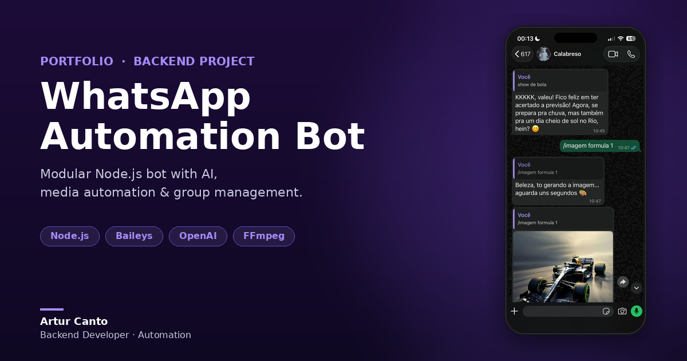

# 🤖 LBOT v2.0 — WhatsApp Bot

> Professional WhatsApp bot with AI, media downloads, group admin tools and entertainment system.

Built with **Baileys** and a fully modular architecture. Features dual-mode behavior — casual in groups, professional in private chats.

[](https://nodejs.org/)
[](https://github.com/WhiskeySockets/Baileys)
[](https://openai.com)
[](LICENSE)

---

## 📱 Preview



*AI answering questions in natural language + image generation on demand*

---

## Features

- 🎭 **Dual Mode** — casual in groups, professional in DMs, automatically
- 🤖 **AI Chat** — OpenAI GPT for natural conversations
- 🎨 **Image Generation** — generate images on demand via `/imagem [prompt]`
- 📥 **Media Downloads** — YouTube (MP3/MP4), TikTok, Instagram
- 🎯 **Sticker Maker** — create stickers from images and videos
- 🔍 **Smart Search** — Google, images, videos
- 👑 **Group Admin** — ban, promote, demote, anti-link, anti-spam
- 💰 **Economy System** — coins, daily rewards, leaderboard
- 📊 **Full Logging** — professional log system

---

## Commands

### General
```
!menu         List all commands
!ping         Bot latency
!info         Bot information
```

### AI
```
!ai [prompt]          Chat with GPT
/imagem [prompt]      Generate an image
```

### Media
```
!ytmp3 [url]      Download YouTube audio
!ytmp4 [url]      Download YouTube video
!tiktok [url]     Download TikTok video
!instagram [url]  Download Instagram media
!sticker          Create sticker (reply to image/video)
```

### Search
```
!google [term]       Search Google
!imagem [term]       Search images
!videosearch [term]  Search videos
```

### Admin (admins only)
```
!ban @user        Remove member
!promote @user    Promote to admin
!demote @user     Demote admin
!antilink on/off  Toggle anti-link
```

### Entertainment
```
!ship @user1 @user2  Compatibility check
!saldo               Check your balance
!daily               Claim daily reward
!ranking             Top 10 leaderboard
```

---

## Getting Started

### Prerequisites

- Node.js 18+
- FFmpeg
- yt-dlp
- OpenAI API key (optional, for AI features)

**Install FFmpeg:**
```bash
# Ubuntu/Debian
sudo apt install ffmpeg

# macOS
brew install ffmpeg

# Windows: https://ffmpeg.org/download.html
```

**Install yt-dlp:**
```bash
# Linux/macOS
sudo curl -L https://github.com/yt-dlp/yt-dlp/releases/latest/download/yt-dlp -o /usr/local/bin/yt-dlp
sudo chmod a+rx /usr/local/bin/yt-dlp

# Windows
winget install yt-dlp
```

### Installation

```bash
# Clone the repo
git clone https://github.com/tutucanto10/Whatsapp-bot-baileys.git
cd Whatsapp-bot-baileys

# Install dependencies
npm install

# Set up environment
cp .env.example .env
# Edit .env with your keys

# Start the bot
npm start
```

Then scan the QR code: WhatsApp → **Settings → Linked Devices → Link a Device**

### Environment Variables

```env
BOT_NAME=LBOT v2.0
PREFIX=!
OWNER_NUMBER=your_number

OPENAI_API_KEY=your_openai_key
AI_MODEL=gpt-3.5-turbo
ENABLE_AI=true

ENABLE_DOWNLOADS=true
ENABLE_STICKERS=true
ENABLE_ANTI_SPAM=true
ENABLE_ANTI_LINK=true

MAX_MESSAGES_PER_MINUTE=10
SPAM_BAN_DURATION=300000
```

---

## Project Structure

```
src/
├── commands/
│   ├── admin/          # Ban, promote, demote, anti-link
│   ├── entertainment/  # Economy, ranking, ship
│   ├── general/        # Menu, ping, info
│   ├── media/          # Downloads, stickers
│   └── search/         # Google, images, videos
├── services/           # AI, media, search services
├── middlewares/        # Anti-spam, anti-link
├── database/           # JSON data layer
├── utils/              # Logger, helpers
├── bot.js              # Baileys setup
├── handler.js          # Message routing
└── index.js            # Entrypoint
```

---

## Deploy

### Railway (recommended)
1. Push to GitHub
2. Connect repo on [railway.app](https://railway.app)
3. Add environment variables
4. Deploy automatically

### VPS (Linux)
```bash
npm install -g pm2
pm2 start src/index.js --name lbot
pm2 save && pm2 startup
```

---

## Troubleshooting

```bash
# Session issues — clear and reconnect
rm -rf sessions/ && npm start

# Dependency issues
rm -rf node_modules package-lock.json && npm install

# Check FFmpeg
ffmpeg -version

# Update yt-dlp
sudo yt-dlp -U
```

---

## Author

**Artur Canto** — Python Backend Developer  
[LinkedIn](https://www.linkedin.com/in/artur-canto-90bb1b224) · [Portfolio](https://devportfolio-puce-two.vercel.app/) · [GitHub](https://github.com/tutucanto10)

---

⭐ If you found this project helpful, please leave a star!

<sub>Built from scratch. No tutorials. Just code.</sub>
